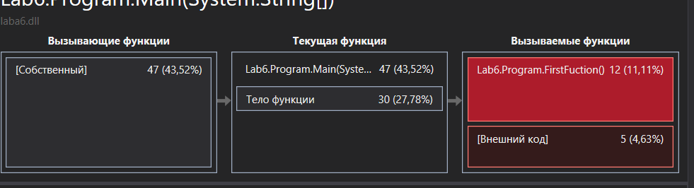

# Lab 6 

## info

In this laboratory for the optimized and old version, we collect the characteristics of the program, such as the execution time of individual fragments (usually subroutines), the number of correctly predicted conditional branches, the number of cache misses, etc. The tool used to analyze the work is called a profiler. or a profiler. Usually done in conjunction with program optimization.

### Old Code

```
using System;
using System.Threading;
namespace Lab6 {
	class Program {


		static void FirstFuction()
		{
			for (int i = 0; i < 1000; i++)
			{
				//process A
				Thread.Sleep(100);
			
			}

			return;
		}

		static void SecondFunction()
		{
			for (int i = 0; i < 1000; i++)
			{
				//process 
				Thread.Sleep(100);
				
			}
			return;
		}

		static void Main(string[] args)
		{
			Console.Write("\n Inside main()\n");
			string numoffunc = "first";			

			int i = 0;

			for (; i < 0xffffff; i++) ;
			switch (numoffunc)
			{
				case "first":
					FirstFuction();
					break;
				case "second":
					SecondFunction();
					break;
			}
		

		}
	}
}
```

#### Performance tests




